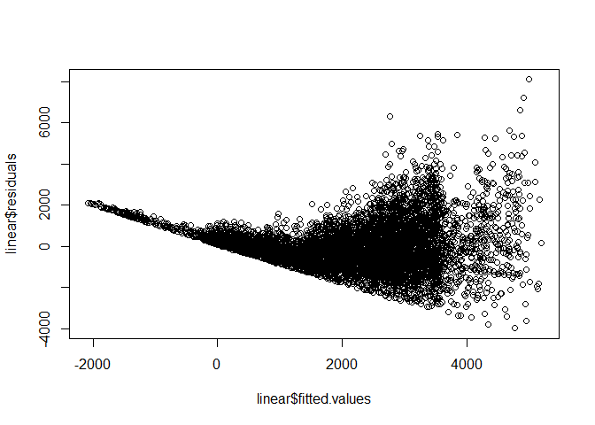
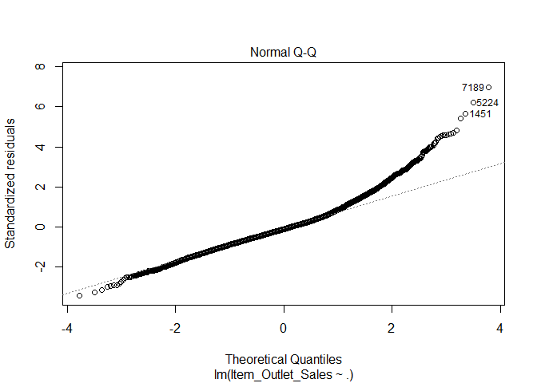

**Install required packages**

``` r
#if(!require("pacman")) install.packages("pacman")
pacman::p_load(ggplot2,cowplot, dplyr, caTools, leaps,caret,glmnet,MASS,regclass,jtools)
```

``` r
data_train<-read.csv("Bigmart_train.csv")#read data
str(data_train)
```

    ## 'data.frame':    8523 obs. of  12 variables:
    ##  $ Item_Identifier          : Factor w/ 1559 levels "DRA12","DRA24",..: 157 9 663 1122 1298 759 697 739 441 991 ...
    ##  $ Item_Weight              : num  9.3 5.92 17.5 19.2 8.93 ...
    ##  $ Item_Fat_Content         : Factor w/ 5 levels "LF","low fat",..: 3 5 3 5 3 5 5 3 5 5 ...
    ##  $ Item_Visibility          : num  0.016 0.0193 0.0168 0 0 ...
    ##  $ Item_Type                : Factor w/ 16 levels "Baking Goods",..: 5 15 11 7 10 1 14 14 6 6 ...
    ##  $ Item_MRP                 : num  249.8 48.3 141.6 182.1 53.9 ...
    ##  $ Outlet_Identifier        : Factor w/ 10 levels "OUT010","OUT013",..: 10 4 10 1 2 4 2 6 8 3 ...
    ##  $ Outlet_Establishment_Year: int  1999 2009 1999 1998 1987 2009 1987 1985 2002 2007 ...
    ##  $ Outlet_Size              : Factor w/ 4 levels "","High","Medium",..: 3 3 3 1 2 3 2 3 1 1 ...
    ##  $ Outlet_Location_Type     : Factor w/ 3 levels "Tier 1","Tier 2",..: 1 3 1 3 3 3 3 3 2 2 ...
    ##  $ Outlet_Type              : Factor w/ 4 levels "Grocery Store",..: 2 3 2 1 2 3 2 4 2 2 ...
    ##  $ Item_Outlet_Sales        : num  3735 443 2097 732 995 ...

We can see there are 4 numeric and 7 categorical variables.

**Univariate
analysis**

``` r
ggplot(data_train)+geom_histogram(mapping=aes(x=Item_Outlet_Sales),binwidth = 100,fill="red")
```

<!-- -->

We can see the variable is right skewed and we would have to apply
transformation to treat the
skewness.

``` r
ggplot(data_train)+geom_histogram(mapping=aes(x=Item_Weight),binwidth=0.5,fill="red")
```

<!-- -->

``` r
ggplot(data_train)+geom_histogram(mapping=aes(x=Item_Visibility),binwidth=0.005,fill="red")
```

<!-- -->

``` r
ggplot(data_train)+geom_histogram(mapping=aes(x=Item_MRP),binwidth=1,fill="red")
```

<!-- -->

There are lot of observations with Item\_Visbility 0 which need to be
imputed with a practical value as item cannot have zero visibility.  
Item\_Visibility is right-skewed and should be transformed to curb its
skewness.  
We can clearly see 4 different distributions for Item\_MRP.

``` r
barplot(table(data_train$Item_Fat_Content))
```

<!-- -->

Change LF and low fat to Low Fat and reg to
regular.

``` r
data_train<-data_train %>% mutate(Item_Fat_Content=as.character(Item_Fat_Content))%>% mutate(Item_Fat_Content = replace(Item_Fat_Content,Item_Fat_Content=="LF"|Item_Fat_Content=="low fat","Low Fat")) %>% mutate(Item_Fat_Content = replace(Item_Fat_Content,Item_Fat_Content=="reg","Regular"))

p1=ggplot(data = data_train) + 
  geom_bar(mapping = aes(x = Item_Fat_Content))
p2=ggplot(data = data_train) + 
  geom_bar(mapping = aes(x = Item_Type))
p3=ggplot(data = data_train) + 
  geom_bar(mapping = aes(x = Outlet_Identifier))
p4=ggplot(data = data_train) + 
  geom_bar(mapping = aes(x = Outlet_Size))
p5=ggplot(data = data_train) + 
  geom_bar(mapping = aes(x = Outlet_Type))
p6=ggplot(data = data_train) + 
  geom_bar(mapping = aes(x = Outlet_Establishment_Year))
plot_grid(p1,p2,ncol=1)
```

<!-- -->

``` r
plot_grid(p3,p4,ncol=1)
```

<!-- -->

``` r
plot_grid(p5,p6,ncol=1)
```

<!-- -->

Observations:  
1.We can see outlet type for around 4000 observations is missing.We will
use imputation techniques to substitute the size for these outlets.  
2.Supermarket type 1 seems to be most popular.

**Bivariate Analysis**

``` r
ggplot(data_train) + 
     geom_point(aes(Item_Weight, Item_Outlet_Sales))
```

<!-- -->

``` r
sapply(data_train,function(x)sum(is.na(x)))
```

    ##           Item_Identifier               Item_Weight          Item_Fat_Content 
    ##                         0                      1463                         0 
    ##           Item_Visibility                 Item_Type                  Item_MRP 
    ##                         0                         0                         0 
    ##         Outlet_Identifier Outlet_Establishment_Year               Outlet_Size 
    ##                         0                         0                         0 
    ##      Outlet_Location_Type               Outlet_Type         Item_Outlet_Sales 
    ##                         0                         0                         0

Impute missing Item\_weights with mean weight of corresponding
Item\_Identifier.

``` r
missing_index<-which(is.na(data_train$Item_Weight))
for(i in missing_index){
  Item<-data_train$Item_Identifier[i]
  data_train$Item_Weight[i]=mean(data_train$Item_Weight[data_train$Item_Identifier == Item],na.rm=T)
}
sum(is.na(data_train$Item_Weight))
```

    ## [1] 4

Impute 0 values of visibility with mean value of visibility for
corresponding Item\_Identifier.

``` r
zero_index<-which(data_train$Item_Visibility == 0)
for(i in zero_index){
  Item<-data_train$Item_Identifier[i]
  data_train$Item_Visibility[i]=mean(data_train$Item_Visibility[data_train$Item_Identifier == Item],na.rm=T)
}
ggplot(data_train) + geom_histogram(aes(Item_Visibility), bins = 100)
```

<!-- -->

``` r
data_train$Item_Type<-as.character(data_train$Item_Type)
IS_NA<-which(is.na(data_train$Item_Weight))
for(i in IS_NA)
{
R<-data_train$Item_Type[i]
data_train$Item_Weight[i]<-mean(data_train$Item_Weight[data_train$Item_Type==R],na.rm=T)
}
table(data_train$Outlet_Type,data_train$Outlet_Size)
```

    ##                    
    ##                          High Medium Small
    ##   Grocery Store      555    0      0   528
    ##   Supermarket Type1 1855  932    930  1860
    ##   Supermarket Type2    0    0    928     0
    ##   Supermarket Type3    0    0    935     0

``` r
data_train$Outlet_Size[data_train$Outlet_Size==""]<-"Small"
```

**Feature Engineering**

Item\_New\_Type = classify Item type into perishable and non
perishable.  
Item\_Category = Categories based on Item\_Identifier(DR for drinks,FD
for food,NC fo non consumable).  
Outlet\_Years = Number of years outlet was open.  
Price\_per\_unit\_weight =
Item\_MRP/Item\_weight.

``` r
perishable = c("Breads", "Breakfast", "Dairy", "Fruits and Vegetables", "Meat", "Seafood")
non_perishable = c("Baking Goods", "Canned", "Frozen Foods", "Hard Drinks", "Health and Hygiene","Household", "Soft Drinks")
data_train$Item_New_Type<-ifelse(data_train$Item_Type %in% perishable,"perishable","non-perishable")

table(data_train$Item_Type, substr(data_train$Item_Identifier, 1, 2))
```

    ##                        
    ##                           DR   FD   NC
    ##   Baking Goods             0  648    0
    ##   Breads                   0  251    0
    ##   Breakfast                0  110    0
    ##   Canned                   0  649    0
    ##   Dairy                  140  542    0
    ##   Frozen Foods             0  856    0
    ##   Fruits and Vegetables    0 1232    0
    ##   Hard Drinks            214    0    0
    ##   Health and Hygiene       0    0  520
    ##   Household                0    0  910
    ##   Meat                     0  425    0
    ##   Others                   0    0  169
    ##   Seafood                  0   64    0
    ##   Snack Foods              0 1200    0
    ##   Soft Drinks            445    0    0
    ##   Starchy Foods            0  148    0

``` r
data_train$Item_Category<-substr(data_train$Item_Identifier, 1, 2)
data_train$Outlet_Years<-2019-data_train$Outlet_Establishment_Year
data_train$Price_per_unit_weight<-data_train$Item_MRP/data_train$Item_Weight
```

``` r
data_train<-data_train %>% mutate(Outlet_Size = if_else(Outlet_Size=="Small",0,if_else(Outlet_Size=="Medium",1,2))) 
data_train<-data_train %>% mutate(Outlet_Location_Type = if_else(Outlet_Location_Type=="Tier 1",0,if_else(Outlet_Location_Type=="Tier 2",1,2)))
```

**Checking correlations**

``` r
cor(data_train$Outlet_Establishment_Year,data_train$Outlet_Years)
```

    ## [1] -1

``` r
cor(data_train$Item_Weight,data_train$Price_per_unit_weight)
```

    ## [1] -0.6107862

``` r
cor(data_train$Item_MRP,data_train$Price_per_unit_weight)
```

    ## [1] 0.6833317

Removing outlet\_establishment\_year and Item\_MRP due to high
correlations.

``` r
data_final<-data_train[,-c(1,8,6,7)]
```

Data
pre-processing.

``` r
ggplot(data_final)+geom_histogram(mapping=aes(x=Item_Visibility),binwidth=0.005,fill="red")
```

<!-- -->

``` r
ggplot(data_final)+geom_histogram(mapping=aes(x=Price_per_unit_weight),binwidth=0.5,fill="red")
```

<!-- -->

Since item\_visibility and Price\_per\_unit\_weight are right skewed we
will apply log transformation to scale them.

``` r
data_final$Item_Visibility<-(data_final$Item_Visibility)^(1/3)
data_final$Price_per_unit_weight= log(data_final$Price_per_unit_weight)
ggplot(data_final)+geom_histogram(mapping=aes(x=Item_Visibility),binwidth=0.005,fill="red")
```

<!-- -->

``` r
ggplot(data_final)+geom_histogram(mapping=aes(x=Price_per_unit_weight),binwidth=0.5,fill="red")
```

<!-- -->

``` r
##split into test and train
split <- sample.split(data_final,SplitRatio = 0.8)
train.set <- subset(data_final,split=="TRUE")
test.set <- subset(data_final,split=="FALSE")
```

Fitting a simple linear regression model.

``` r
linear<-lm(Item_Outlet_Sales ~ ., data = train.set)
summary(linear)
```

    ## 
    ## Call:
    ## lm(formula = Item_Outlet_Sales ~ ., data = train.set)
    ## 
    ## Residuals:
    ##     Min      1Q  Median      3Q     Max 
    ## -3978.4  -725.9  -112.3   545.2  8094.9 
    ## 
    ## Coefficients: (2 not defined because of singularities)
    ##                                 Estimate Std. Error t value Pr(>|t|)    
    ## (Intercept)                    -5299.608    230.537 -22.988   <2e-16 ***
    ## Item_Weight                      144.653      3.896  37.133   <2e-16 ***
    ## Item_Fat_ContentRegular           45.255     33.966   1.332   0.1828    
    ## Item_Visibility                  -90.297    154.394  -0.585   0.5587    
    ## Item_TypeBreads                   -7.172    100.575  -0.071   0.9432    
    ## Item_TypeBreakfast                89.747    142.895   0.628   0.5300    
    ## Item_TypeCanned                   32.423     75.933   0.427   0.6694    
    ## Item_TypeDairy                    60.397     79.605   0.759   0.4481    
    ## Item_TypeFrozen Foods             71.653     71.166   1.007   0.3141    
    ## Item_TypeFruits and Vegetables    60.946     67.163   0.907   0.3642    
    ## Item_TypeHard Drinks              24.494    166.473   0.147   0.8830    
    ## Item_TypeHealth and Hygiene       -3.174    151.317  -0.021   0.9833    
    ## Item_TypeHousehold                29.873    146.309   0.204   0.8382    
    ## Item_TypeMeat                     42.112     85.427   0.493   0.6221    
    ## Item_TypeOthers                    4.317    175.096   0.025   0.9803    
    ## Item_TypeSeafood                 321.598    170.500   1.886   0.0593 .  
    ## Item_TypeSnack Foods               8.474     67.385   0.126   0.8999    
    ## Item_TypeSoft Drinks             -46.944    152.844  -0.307   0.7588    
    ## Item_TypeStarchy Foods           176.058    127.759   1.378   0.1682    
    ## Outlet_Size                       45.678     45.141   1.012   0.3116    
    ## Outlet_Location_Type             -19.840     26.449  -0.750   0.4532    
    ## Outlet_TypeSupermarket Type1    1891.200     73.507  25.728   <2e-16 ***
    ## Outlet_TypeSupermarket Type2    1489.964    124.042  12.012   <2e-16 ***
    ## Outlet_TypeSupermarket Type3    3367.616     66.831  50.390   <2e-16 ***
    ## Item_New_Typeperishable               NA         NA      NA       NA    
    ## Item_CategoryFD                  -30.146    129.159  -0.233   0.8155    
    ## Item_CategoryNC                       NA         NA      NA       NA    
    ## Outlet_Years                      -8.224      4.525  -1.818   0.0692 .  
    ## Price_per_unit_weight           1715.723     27.584  62.201   <2e-16 ***
    ## ---
    ## Signif. codes:  0 '***' 0.001 '**' 0.01 '*' 0.05 '.' 0.1 ' ' 1
    ## 
    ## Residual standard error: 1164 on 6366 degrees of freedom
    ## Multiple R-squared:  0.5328, Adjusted R-squared:  0.5309 
    ## F-statistic: 279.3 on 26 and 6366 DF,  p-value: < 2.2e-16

``` r
MSE<-mean(linear$residuals^2)
RMSE<-sqrt(MSE)
RMSE
```

    ## [1] 1161.45

``` r
AIC(linear)
```

    ## [1] 108434.8

``` r
plot(linear$fitted.values,linear$residuals)
```

<!-- -->

``` r
plot(linear,2)
```

<!-- --> The
simple linear regression model for Item\_Outlet\_Size gave R2 value of
0.54 and RMSE of 1163.28.We can see that there are a lot of
insignificant predictors with high p values.We will use subset selection
to find the best predictors.

Compute Variance Inflation Factors (VIF) for the numeric predictors.

``` r
data_num<-train.set[,c(1,3,8,11,12)]
multi_check<-lm(Item_Outlet_Sales~.,data=data_num)
VIF(multi_check)
```

    ##           Item_Weight       Item_Visibility          Outlet_Years 
    ##              1.508490              1.004075              1.003529 
    ## Price_per_unit_weight 
    ##              1.507985

VIF\<5.No significant multicollinearity present.  
As the fitted values increases,the variance of the residuals also
increases.The residual plot is cone shaped which indicates
heteroscedasticity.  
We will use transformation of dependent variable Item\_outlet\_sales to
remove heteroscedasticity.We will use sqrt and log to see which is
better.

``` r
linear1<-lm(log(Item_Outlet_Sales) ~ ., data = train.set)
summary(linear1)
```

    ## 
    ## Call:
    ## lm(formula = log(Item_Outlet_Sales) ~ ., data = train.set)
    ## 
    ## Residuals:
    ##      Min       1Q   Median       3Q      Max 
    ## -2.16484 -0.27854  0.05684  0.36833  1.35064 
    ## 
    ## Coefficients: (2 not defined because of singularities)
    ##                                 Estimate Std. Error t value Pr(>|t|)    
    ## (Intercept)                     2.331960   0.104039  22.414   <2e-16 ***
    ## Item_Weight                     0.084204   0.001758  47.897   <2e-16 ***
    ## Item_Fat_ContentRegular         0.006133   0.015328   0.400   0.6891    
    ## Item_Visibility                -0.013893   0.069677  -0.199   0.8420    
    ## Item_TypeBreads                -0.017152   0.045389  -0.378   0.7055    
    ## Item_TypeBreakfast             -0.020853   0.064487  -0.323   0.7464    
    ## Item_TypeCanned                 0.004382   0.034268   0.128   0.8983    
    ## Item_TypeDairy                 -0.041007   0.035925  -1.141   0.2537    
    ## Item_TypeFrozen Foods          -0.005088   0.032117  -0.158   0.8741    
    ## Item_TypeFruits and Vegetables  0.007623   0.030310   0.252   0.8014    
    ## Item_TypeHard Drinks           -0.086261   0.075128  -1.148   0.2509    
    ## Item_TypeHealth and Hygiene    -0.056000   0.068288  -0.820   0.4122    
    ## Item_TypeHousehold             -0.085655   0.066028  -1.297   0.1946    
    ## Item_TypeMeat                   0.048513   0.038552   1.258   0.2083    
    ## Item_TypeOthers                -0.071394   0.079019  -0.904   0.3663    
    ## Item_TypeSeafood                0.061666   0.076945   0.801   0.4229    
    ## Item_TypeSnack Foods            0.002268   0.030410   0.075   0.9405    
    ## Item_TypeSoft Drinks           -0.098059   0.068977  -1.422   0.1552    
    ## Item_TypeStarchy Foods          0.042489   0.057657   0.737   0.4612    
    ## Outlet_Size                     0.020244   0.020371   0.994   0.3204    
    ## Outlet_Location_Type           -0.020485   0.011936  -1.716   0.0862 .  
    ## Outlet_TypeSupermarket Type1    1.909392   0.033173  57.559   <2e-16 ***
    ## Outlet_TypeSupermarket Type2    1.695104   0.055979  30.281   <2e-16 ***
    ## Outlet_TypeSupermarket Type3    2.484022   0.030160  82.360   <2e-16 ***
    ## Item_New_Typeperishable               NA         NA      NA       NA    
    ## Item_CategoryFD                -0.080416   0.058288  -1.380   0.1677    
    ## Item_CategoryNC                       NA         NA      NA       NA    
    ## Outlet_Years                   -0.004220   0.002042  -2.067   0.0388 *  
    ## Price_per_unit_weight           1.005021   0.012448  80.736   <2e-16 ***
    ## ---
    ## Signif. codes:  0 '***' 0.001 '**' 0.01 '*' 0.05 '.' 0.1 ' ' 1
    ## 
    ## Residual standard error: 0.5253 on 6366 degrees of freedom
    ## Multiple R-squared:  0.7345, Adjusted R-squared:  0.7335 
    ## F-statistic: 677.5 on 26 and 6366 DF,  p-value: < 2.2e-16

``` r
MSE<-mean(linear1$residuals^2)
RMSE<-sqrt(MSE)
RMSE
```

    ## [1] 0.5241508

``` r
AIC(linear1)
```

    ## [1] 9939.102

``` r
plot(linear1$fitted.values,linear1$residuals)
```

<!-- -->

``` r
plot(linear1,2)
```

<!-- -->
Heteroscedasticity is reduced by taking log transformation of dependent
variable, Item\_Outlet\_Sales. Regression model using log transformed
Item\_Outlet\_Size gave R2 value of 0.73 and RMSE of 0.51 and AIC of
9784.412.As we can see there are a lot of insignificant
predictors.Hence,we can perform subset selection to determine the best
predictors that explain Item Outlet Sales.

**Best subset selection**

``` r
train.set$Item_Outlet_Sales<-log(train.set$Item_Outlet_Sales)
smallest <- Item_Outlet_Sales ~ 1
biggest <- Item_Outlet_Sales ~ Item_Weight+Item_Fat_Content+Item_Visibility +Item_Type+ Outlet_Size  +Outlet_Location_Type + Outlet_Type +Item_New_Type+Item_Category +Outlet_Years+Price_per_unit_weight
m <- lm(Item_Outlet_Sales ~ Item_Weight, data=train.set)
stats::step(m, scope=list(lower=smallest, upper=biggest)) 
```

    ## Start:  AIC=222.09
    ## Item_Outlet_Sales ~ Item_Weight
    ## 
    ##                         Df Sum of Sq    RSS     AIC
    ## + Outlet_Type            3   3031.46 3583.4 -3690.9
    ## + Price_per_unit_weight  1   1804.53 4810.3 -1812.4
    ## + Outlet_Size            1    293.24 6321.6   -65.8
    ## + Item_Visibility        1    190.06 6424.8    37.7
    ## + Outlet_Years           1     42.56 6572.3   182.8
    ## + Outlet_Location_Type   1     22.85 6592.0   202.0
    ## + Item_Category          2      5.14 6609.7   221.1
    ## - Item_Weight            1      1.69 6616.5   221.7
    ## + Item_Type             15     31.31 6583.5   221.8
    ## <none>                               6614.9   222.1
    ## + Item_New_Type          1      0.88 6614.0   223.2
    ## + Item_Fat_Content       1      0.32 6614.5   223.8
    ## 
    ## Step:  AIC=-3690.86
    ## Item_Outlet_Sales ~ Item_Weight + Outlet_Type
    ## 
    ##                         Df Sum of Sq    RSS     AIC
    ## + Price_per_unit_weight  1   1822.12 1761.3 -8229.7
    ## + Item_Type             15     22.72 3560.7 -3701.5
    ## + Item_Category          2      6.47 3576.9 -3698.4
    ## + Item_New_Type          1      2.69 3580.7 -3693.7
    ## + Outlet_Years           1      1.47 3581.9 -3691.5
    ## - Item_Weight            1      0.78 3584.2 -3691.5
    ## <none>                               3583.4 -3690.9
    ## + Outlet_Size            1      0.98 3582.4 -3690.6
    ## + Item_Visibility        1      0.84 3582.6 -3690.4
    ## + Outlet_Location_Type   1      0.41 3583.0 -3689.6
    ## + Item_Fat_Content       1      0.04 3583.4 -3688.9
    ## - Outlet_Type            3   3031.46 6614.9   222.1
    ## 
    ## Step:  AIC=-8229.65
    ## Item_Outlet_Sales ~ Item_Weight + Outlet_Type + Price_per_unit_weight
    ## 
    ##                         Df Sum of Sq    RSS     AIC
    ## + Outlet_Years           1      1.52 1759.7 -8233.2
    ## + Outlet_Size            1      0.91 1760.4 -8231.0
    ## + Outlet_Location_Type   1      0.67 1760.6 -8230.1
    ## <none>                               1761.3 -8229.7
    ## + Item_Fat_Content       1      0.05 1761.2 -8227.8
    ## + Item_Visibility        1      0.03 1761.2 -8227.7
    ## + Item_New_Type          1      0.02 1761.2 -8227.7
    ## + Item_Category          2      0.05 1761.2 -8225.8
    ## + Item_Type             15      2.06 1759.2 -8207.1
    ## - Item_Weight            1    649.65 2410.9 -6224.4
    ## - Price_per_unit_weight  1   1822.12 3583.4 -3690.9
    ## - Outlet_Type            3   3049.05 4810.3 -1812.4
    ## 
    ## Step:  AIC=-8233.18
    ## Item_Outlet_Sales ~ Item_Weight + Outlet_Type + Price_per_unit_weight + 
    ##     Outlet_Years
    ## 
    ##                         Df Sum of Sq    RSS     AIC
    ## <none>                               1759.7 -8233.2
    ## + Outlet_Location_Type   1      0.54 1759.2 -8233.1
    ## + Item_Fat_Content       1      0.05 1759.7 -8231.4
    ## + Item_Visibility        1      0.02 1759.7 -8231.3
    ## + Item_New_Type          1      0.02 1759.7 -8231.3
    ## + Outlet_Size            1      0.00 1759.7 -8231.2
    ## - Outlet_Years           1      1.52 1761.3 -8229.7
    ## + Item_Category          2      0.05 1759.7 -8229.4
    ## + Item_Type             15      2.01 1757.7 -8210.5
    ## - Item_Weight            1    650.06 2409.8 -6225.4
    ## - Price_per_unit_weight  1   1822.18 3581.9 -3691.5
    ## - Outlet_Type            3   3003.58 4763.3 -1873.2

    ## 
    ## Call:
    ## lm(formula = Item_Outlet_Sales ~ Item_Weight + Outlet_Type + 
    ##     Price_per_unit_weight + Outlet_Years, data = train.set)
    ## 
    ## Coefficients:
    ##                  (Intercept)                   Item_Weight  
    ##                     2.190689                      0.084236  
    ## Outlet_TypeSupermarket Type1  Outlet_TypeSupermarket Type2  
    ##                     1.934934                      1.722058  
    ## Outlet_TypeSupermarket Type3         Price_per_unit_weight  
    ##                     2.474542                      1.003687  
    ##                 Outlet_Years  
    ##                    -0.002705

``` r
lm_step<-lm(Item_Outlet_Sales ~ Item_Weight + Outlet_Type + Price_per_unit_weight + Item_Fat_Content + Outlet_Location_Type, data = train.set)
summary(lm_step)
```

    ## 
    ## Call:
    ## lm(formula = Item_Outlet_Sales ~ Item_Weight + Outlet_Type + 
    ##     Price_per_unit_weight + Item_Fat_Content + Outlet_Location_Type, 
    ##     data = train.set)
    ## 
    ## Residuals:
    ##      Min       1Q   Median       3Q      Max 
    ## -2.14302 -0.28242  0.05632  0.36967  1.41610 
    ## 
    ## Coefficients:
    ##                               Estimate Std. Error t value Pr(>|t|)    
    ## (Intercept)                   2.130341   0.050530  42.160   <2e-16 ***
    ## Item_Weight                   0.084235   0.001735  48.549   <2e-16 ***
    ## Outlet_TypeSupermarket Type1  1.952444   0.020076  97.251   <2e-16 ***
    ## Outlet_TypeSupermarket Type2  1.783720   0.028828  61.875   <2e-16 ***
    ## Outlet_TypeSupermarket Type3  2.471328   0.028754  85.948   <2e-16 ***
    ## Price_per_unit_weight         1.003757   0.012347  81.298   <2e-16 ***
    ## Item_Fat_ContentRegular       0.005874   0.013755   0.427    0.669    
    ## Outlet_Location_Type         -0.015343   0.009857  -1.557    0.120    
    ## ---
    ## Signif. codes:  0 '***' 0.001 '**' 0.01 '*' 0.05 '.' 0.1 ' ' 1
    ## 
    ## Residual standard error: 0.5251 on 6385 degrees of freedom
    ## Multiple R-squared:  0.7339, Adjusted R-squared:  0.7336 
    ## F-statistic:  2516 on 7 and 6385 DF,  p-value: < 2.2e-16

``` r
MSE<-mean(lm_step$residuals^2)
RMSE<-sqrt(MSE)
RMSE
```

    ## [1] 0.5247735

``` r
AIC(lm_step)
```

    ## [1] 9916.281

Step wise selection method was used to select the best subset of
predictors using AIC criteria. The resulting best model has 5 variables
which are
Outlet\_Type,Price\_per\_unit\_weight,Item\_Weight,Item\_Fat\_Content
and Outlet\_location\_type.The model has R2 value of 0.74 and RMSE of
0.51 and AIC has reduced from 9784.412 to 9767.42.

Testing the model on test set.

``` r
pred<-predict(lm_step,test.set[,-8])
test.set$Item_Outlet_Sales<-log(test.set$Item_Outlet_Sales)
residuals<-test.set$Item_Outlet_Sales-pred
RSS_test<-sum(residuals^2)
TSS_test<-sum((test.set$Item_Outlet_Sales-mean(test.set$Item_Outlet_Sales))^2)
R2_test<-1-(RSS_test/TSS_test)
MSE_test<-mean(residuals^2)
RMSE_test<-sqrt(MSE_test)
R2_test##R-square of train dataset
```

    ## [1] 0.7385852

``` r
RMSE_test##residual mean standard error of train data set.
```

    ## [1] 0.5195449

The model has R2 value of 0.71 and RMSE of 0.54 on the test dataset.

Build Random Forest Model.

``` r
control <- trainControl(method = 'cv',number = 5)
seed <- 1234
tgrid = expand.grid(mtry = c(3:10))
set.seed(seed)
fit_rf_grid <- train(Item_Outlet_Sales~.,data=train.set,method='rf',tuneGrid = tgrid,trControl=control)
fit_rf_grid
```

    ## Random Forest 
    ## 
    ## 6393 samples
    ##   11 predictor
    ## 
    ## No pre-processing
    ## Resampling: Cross-Validated (5 fold) 
    ## Summary of sample sizes: 5113, 5115, 5113, 5115, 5116 
    ## Resampling results across tuning parameters:
    ## 
    ##   mtry  RMSE       Rsquared   MAE      
    ##    3    0.6217335  0.6679615  0.4894263
    ##    4    0.5812071  0.6882484  0.4554780
    ##    5    0.5643508  0.6986186  0.4412266
    ##    6    0.5548164  0.7054048  0.4332800
    ##    7    0.5498680  0.7091610  0.4289714
    ##    8    0.5480592  0.7103466  0.4274198
    ##    9    0.5471744  0.7110076  0.4267824
    ##   10    0.5467566  0.7113939  0.4268568
    ## 
    ## RMSE was used to select the optimal model using the smallest value.
    ## The final value used for the model was mtry = 10.

``` r
plot(fit_rf_grid)
```

<!-- -->

``` r
varImp(fit_rf_grid)
```

    ## rf variable importance
    ## 
    ##   only 20 most important variables shown (out of 28)
    ## 
    ##                                 Overall
    ## Price_per_unit_weight          100.0000
    ## Outlet_Size                     49.1753
    ## Outlet_TypeSupermarket Type1    49.0329
    ## Item_Weight                     33.3680
    ## Outlet_Years                    29.9583
    ## Item_Visibility                 25.8257
    ## Outlet_TypeSupermarket Type3    19.2527
    ## Outlet_Location_Type            12.3795
    ## Outlet_TypeSupermarket Type2     7.1341
    ## Item_Fat_ContentRegular          1.9154
    ## Item_TypeSnack Foods             1.2888
    ## Item_New_Typeperishable          1.1705
    ## Item_TypeCanned                  1.1057
    ## Item_TypeFrozen Foods            1.0906
    ## Item_TypeFruits and Vegetables   0.9913
    ## Item_TypeDairy                   0.8889
    ## Item_CategoryFD                  0.8256
    ## Item_TypeHousehold               0.7100
    ## Item_CategoryNC                  0.5419
    ## Item_TypeSoft Drinks             0.5365

Used cross validation approach to select the best mtry value.mtry=10
gives model with lowest RMSE of 0.54 and highest R2 of 0.71.Hence
selected as the final model.

Test random forest model on test dataset.

``` r
predictions <- predict(fit_rf_grid,test.set[,-8])
residuals<-test.set$Item_Outlet_Sales-predictions
RSS_test<-sum(residuals^2)
TSS_test<-sum((test.set$Item_Outlet_Sales-mean(test.set$Item_Outlet_Sales))^2)
R2_test<-1-(RSS_test/TSS_test)
MSE_test<-mean(residuals^2)
RMSE_test<-sqrt(MSE_test)
R2_test##R-square of train dataset
```

    ## [1] 0.7157646

``` r
RMSE_test##
```

    ## [1] 0.5417477

The Random Forest model gives R2 value of 0.70 and RMSE of 0.55 on the
test dataset.

We will select the step wise regression model as our final model.

The final prediction model:  
Item\_Outlet\_Sales \~ Item\_Weight + Outlet\_Type +
Price\_per\_unit\_weight + Item\_Fat\_Content + Outlet\_Location\_Type  
We evaluated product level and store level attributes that influence
sales with taking into consideration assumptions of multicollinearity,
normality and homoscedasticity. As a result, we have achieved a
regression model with accuracy of 73%.
